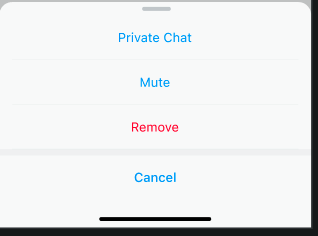

# Appearance

Appearance.swift is a class file that configures some UI options before launchRoomView.

## Available options

1. [Appearance.pageContainerTitleBarItemWidth](https://github.com/zjc19891106/ChatroomUIKit/blob/main/Sources/ChatroomUIKit/Classes/UI/Core/UIKit/Utils/Appearance.swift). It can be used to modify the single content width of the titleBar in the pageContainer.

.

2. [Appearance.pageContainerConstraintsSize](https://github.com/zjc19891106/ChatroomUIKit/blob/main/Sources/ChatroomUIKit/Classes/UI/Core/UIKit/Utils/Appearance.swift).It can change the height of the container pop-up window in the

.

3. [Appearance.giftContainerConstraintsSize](https://github.com/zjc19891106/ChatroomUIKit/blob/main/Sources/ChatroomUIKit/Classes/UI/Core/UIKit/Utils/Appearance.swift).It can change the height of the gift container pop-up window in the 

.

4. [Appearance.barrageCellStyle](https://github.com/zjc19891106/ChatroomUIKit/blob/main/Sources/ChatroomUIKit/Classes/UI/Core/UIKit/Utils/Appearance.swift).It can change the style of the barrage in the

.

5. [`Appearance.colorHues`,`Appearance.secondaryHue`,`Appearance.errorHue`,`Appearance.neutralHue`,`Appearance.neutralSpecialHue`](https://github.com/zjc19891106/ChatroomUIKit/blob/main/Sources/ChatroomUIKit/Classes/UI/Core/UIKit/Utils/Appearance.swifthttps://github.com/zjc19891106/ChatroomUIKit/blob/main/Sources/ChatroomUIKit/Classes/UI/Core/Theme/ColorTheme.swift).Changing these five can customize a theme color system. The colors of the related color systems used internally in ChatroomUIKit will change as they change.[UIDesign](https://www.figma.com/file/OX2dUdilAKHahAh9VwX8aI/Streamuikit?node-id=137%3A38589&mode=dev)

6. [Appearance.emojiMap](https://github.com/zjc19891106/ChatroomUIKit/blob/main/Sources/ChatroomUIKit/Classes/UI/Components/Input/Convertor/ChatEmojiConvertor.swift).If you want to replace all custom expressions, you can set this attribute Key using the specified string value using the image you want to replace.

.

7. [Appearance.targetLanguage](https://github.com/zjc19891106/ChatroomUIKit/blob/main/Sources/ChatroomUIKit/Classes/UI/Core/UIKit/Utils/LanguageConvertor.swift).You can set the target translation language for text messages by modifying it. The translation languages supported by chat room UIKit are in LanguageType and can be extended.

8. `Appearance.defaultMessageActions`.The data source of the pop-up window that pops up after long-pressing the message in the chat room can be changed to add or delete services.

.

9. `Appearance.defaultOperationUserActions`.In the member list pop-up window in the chat room, click the More button on the right to pop up the data source in the Action Sheet, which can be changed to add or delete services.

.

10. ``Appearance.actionSheetRowHeight``.The height of a single item in all ActionSheets.

.

11. ``Appearance.giftPlaceHolder``.

.

12. [Appearance.avatarPlaceHolder](https://github.com/zjc19891106/ChatroomUIKit/blob/main/Sources/ChatroomUIKit/Classes/UI/Components/Chat/Cells/ChatBarrageCell.swift).

13. [Appearance.userIdentifyPlaceHolder]((https://github.com/zjc19891106/ChatroomUIKit/blob/main/Sources/ChatroomUIKit/Classes/UI/Components/Chat/Cells/ChatBarrageCell.swift)).

14. ``Appearance.notifyMessageIcon``.

15. [Appearance.maxInputHeight](https://github.com/zjc19891106/ChatroomUIKit/blob/main/Sources/ChatroomUIKit/Classes/UI/Components/Input/Views/ChatInputBar.swift).

16. [Appearance.inputPlaceHolder](https://github.com/zjc19891106/ChatroomUIKit/blob/main/Sources/ChatroomUIKit/Classes/UI/Components/Input/Views/ChatInputBar.swift).

 default is Aa.

17. [Appearance.inputBarCorner](https://github.com/zjc19891106/ChatroomUIKit/blob/main/Sources/ChatroomUIKit/Classes/UI/Components/Input/Views/ChatInputBar.swift).

 radius corner default is large.

18. ``Appearance.reportTags``.

