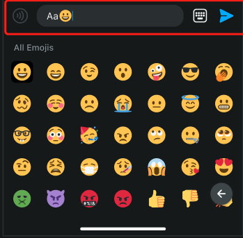

# [ComponentRegister](https://github.com/zjc19891106/ChatroomUIKit/blob/main/Sources/ChatroomUIKit/Classes/UI/Core/UIKit/Utils/ComponentsRegister.swift)

An object containing types of UI Components that are used through the ChatroomUIKit SDK.

## Classes that can be inherited and modified

1. [ComponentsRegister.shared.GiftBarragesViewCell](https://github.com/zjc19891106/ChatroomUIKit/blob/main/Sources/ChatroomUIKit/Classes/UI/Components/Gift/Cells/GiftBarrageCell.swift).

.

2. [ComponentsRegister.shared.GiftEntityCell](https://github.com/zjc19891106/ChatroomUIKit/blob/main/Sources/ChatroomUIKit/Classes/UI/Components/Gift/Cells/GiftEntityCell.swift).

.

3. [ComponentsRegister.shared.ChatInputBar](https://github.com/zjc19891106/ChatroomUIKit/blob/main/Sources/ChatroomUIKit/Classes/UI/Components/Gift/Cells/GiftEntityCell.swift).

.

4. [ComponentsRegister.shared.ChatBarrageCell](https://github.com/zjc19891106/ChatroomUIKit/blob/main/Sources/ChatroomUIKit/Classes/UI/Components/Chat/Cells/ChatBarrageCell.swift).

.

5. [ComponentsRegister.shared.ReportOptionsController](https://github.com/zjc19891106/ChatroomUIKit/blob/main/Sources/ChatroomUIKit/Classes/UI/Components/Chat/Controllers/ReportOptionsController.swift).

.

6. [ComponentsRegister.shared.ParticipantsViewController](https://github.com/zjc19891106/ChatroomUIKit/blob/main/Sources/ChatroomUIKit/Classes/UI/Components/Room/Controllers/ParticipantsController.swift)

.